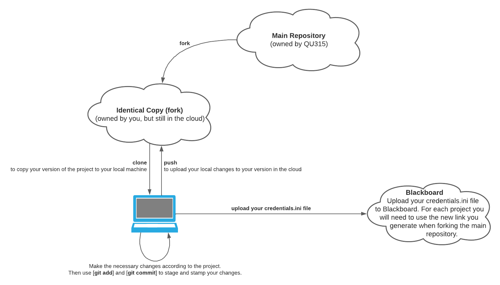

# Project-0-Hello

Trivial project to exercise version control, turn-in, and other
skills.

## Assignment:

- If you see this README.md file, it means you have successfully forked the class main repository for project-0. Next, 
  you will have to clone your copy of the project from the cloud to your own local machine and start working on the
  assignment.
- Before you edit a file, read the comments (inside that file) carefully.
- Copy the `credentials-skel.ini` file, and name the new copy as 
  `credentials.ini`. Then follow the instructions accordingly.
- Modify the program `hello.py` so that it prints `Hello
  315 Class` instead of `Hello World` (Nothing more and nothing less).
- Test your program locally; revise and re-test as needed. Testing is easy
  which you can do by running `python3 hello.py` to validate the output.
- Commit your changes. You will need to use `git add` on your
  `hello.py` file, but *not* on `credentials.ini`, because that
  file does not belong on GitHub. The `credentials.ini` file is your
  key to submitting the assignment. It will only be submitted to 
  [Blackboard](https://lms.qu.edu.sa/).
- Then use `git commit -m "<your message>"` to stamp your changes.
- Your changes **MUST** be "pushed" to your private repository
  on GitHub so that the auto-grader can "clone" them back to the
  grading machine. You can do so by running `git push`.
- Turn in with Blackboard. The file you turn in is the `credentials.ini`. We
  use the repository link in your `credentials.ini` to access your work.

## Development Workflow

For each project you would have to do the following.



#### 1) Clone the New Repo to Your Local Machine

From the new fork you created, you need to clone it to your local machine to be able to make changes. 
1. Click on "Code" from the main page of your fork.
2. Copy the link (use ssh).
3. Run the `git clone` command (using PyCharm, Terminal, or CMD) to have a copy of the project in your local machine. 

#### 2) Make the Changes You Need to Make According to the Project Instructions 

This is the IT315 core step. That is, this is you working on the project by writing a new code.
The instructions are always given in the **Assignment** section of all README.md files.

#### 3) Commit the Changes You Made Locally

The commit step in git is just a way of putting a sealing on your changes and giving it a description. 
Usually all you need is to run the two following commands:

1. ```sh
    git add <file_name>
   ```
2. ```sh
    git commit -m "the change description you want ot add here"
   ```

#### 4) Push Your Changes From Your Local Copy to the Repo in the Cloud

This is the easiest step. All you need to do is run the following command.

```sh
git push
```

#### 5) Add the New Project Information to a `credential.ini` File

1. Add your name to the credential file using the same skeleton given to you.
2. The default (`[default]`) tag should not be changed.
3. Add your name (e.g., `author= Ahmad Saleh`)
4. Add your forked repo link (e.g., `repo= git@github.com:quit315/project-0-hello.git`). Be careful not to copy the git commands such as `git clone` from GitHub.
5. Add your QU ID (e.g., `quid= 931100100`)

Here is a sample of the .ini file if I would submit it. 

```ini
#
# Credentials:
#
#    This is simply a key file to turn in your work. 
# 	 Any missing or wrong information could lead to
#    a failure in the whole assignment. Please change 
#    the filed below according to the examples provided.

[DEFAULT] 
author= Ziyad Alsaeed
repo= git@github.com:quit315/project-0-hello.git
quid= 931100100
```

#### 6) Submit Your `credentials.ini` File to Blackboard

Now all you need is to submit your file to Blackboard. Without the file and its correct information we would not be
able to grade your project.

## Reminders

- The `credentials.ini` file **MUST** include your full information just as
  given in the `credentials-skel.ini`. See the section above for an example.
- DO NOT push any changes to your repo after the deadline. When we clone
  your repo given the key, we will check when was the last update on your
  repository. If you made any changes passed the deadline you will immediately 
  get 20% deducted.

## Grading Rubric

- **[40 Points]** For submitting your `credentials.ini` file to Blackboard.
  You get 10 points for each correctly provided field.
- **[30 Points]** if you update the `hello.py` file correctly.
- **[30 Points]** if you set up your forked repository correctly as a private
  repo and given us the appropriate access.

# All Rights Reserved

This is the work of Ziyad Alsaeed. Any copy or distribution of this
repository or a fork of it in a way other than the instruction provided
above will subject you to legal proceedings.
